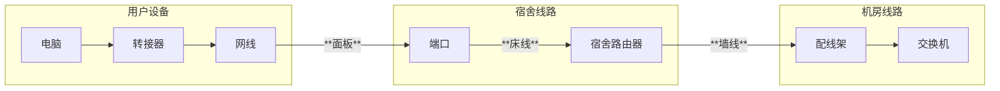

# 对线
宿舍以太网的连接由网线负责传输，如果网线，或者配线架，交换机这些物理设备本身的端口出现了问题，那么网络就当然无法连接，对线的过程便是测试物理连接是否能工作的流程
## 操作流程
### 准备
打开寻线器，将寻线器的模式调到“对线”档位，将网线的一端插入到接口内，将另一端插入到要测试的端口
### 检查
如果寻线器上的1-8灯全部**按顺序**亮起的话，那么说明物理层连接没有问题，如果有哪个灯不亮，那么说明对应的电线不通，一般只要1,2,3,6灯亮起，那么网络才能保证最基本工作，但是网速会比较慢
## 排查
对线只能指示寻线器到信号发射设备（楼层交换机，宿舍路由器等）的整体线路是否完好，如果这中间有问题，他是无法测出是哪一个部分的问题的，这个时候，就需要我们进行测试排查

### 流程
下面是理想情况下校园网的结构，在实际工作中，每个片区我们只需要接触到其中的一部分：

对线结果显示有问题的话，我们可以更换已知的正常设备来排查错误的地方,例如，如果使用用户的转接口，用户的网线对线失败的话，那么就先更换成一个正常的转接口，如果还是失败，那么就把网线换成好的网线，如果这个时候对线成功了，那么我们就可以判断是用户网线的问题，就可以让用户更换网线了，如果还是失败的话，那么试一试将电脑直连路由器，如果成功了，那么就可以排查出，是宿舍墙线或者端口的问题，重做端口后用端口连接路由器，如果失败的话就可以发现是线路的故障，这个时候就可以尝试飞线或直接上报组长，如果直连主线没问题而经过路由器有问题的话，那么就是路由器的问题，如果直连交换机端口没问题，而在宿舍里有问题的话，那么就是楼层线路的问题，如果直连交换机有问题的话，那么就是交换机端口的问题，可以给用户换一个没问题的端口

