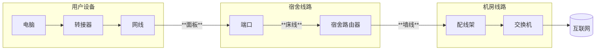
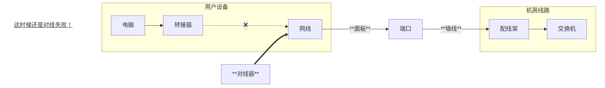
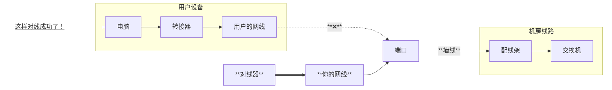

---

description: 如何通过对线来测试网线工作情况，与如何利用对线的信息排查网络连接

---
# 寻线器-对线
:::warning 注意

🚧施工中🚧

这篇文章还没有写完呢！😛

:::

寻线器的“对线”功能也叫线序测试（Wiremap），用于检查网络链路内部8芯线对的连接情况和品质。

如果我们要使用对线功能，一般是如下情况：

1. **检查一段网络线路物理层是否正常(比如用户端口到交换机)**

2. **检查某根网线是不是工作正常**

我们先来讲对线网线的操作：

## 网线的对线
1. **连接线缆两端**： 将待测试网线的一端连接到发射器的RJ45端口，另一端连接到接收器的RJ45端口。

2. **开启对线模式**： 将发射器的功能选择开关拨到“对线”档位。

3. **观察并解读指示灯**： 此时，发射器和接收器上的8个线序指示灯（分别对应1-8号线芯）会开始闪烁。你需要对比两端的亮灯情况来判断线路状态。

### 闪烁情况
网络链路可能会有如下情况：

- **正常**:如果是标准的直通线（T568B或T568A），发射器和接收器上的1到8号指示灯会一一对应、同步、依次快速闪烁。这是最理想的状态。

- **断路/开路** (Open): 线缆的线芯断开，体现为某一根或几根线芯的指示灯在**两端都不亮**，这些线芯存在断路，信号无法通过。

- **短路**：线芯之间互相接触了，体现为发射端正常，但是**接收端**的几根线芯不亮，说明内部存在短路，通常是水晶头没做好，需要重做水晶头。

- **乱序/错线**(Miswire):线序接乱了，表现为发射端和接收端指示灯的闪烁顺序不一致（例如，发射器上是1-2-3-4...，而接收器上是1-3-2-4...），需要重做水晶头。

- **交叉** (Crossover): 如果是交叉线，指示灯会按照交叉的配对规则亮起（如1对3，2对6等）。

## 物理线路的排查
对于物理线路的排查，其实和测试网线差不多。最重要的是，需要知道某些网络设备(如路由器，交换机等)可以视为寻线器的接收端。如果网线一端连接发射端，另一端连接路由器或交换机。那么在正常工作的情况下，发射端就会像网线那样正常亮起。在这里不需要使用寻线器的接收端。

### 系统地排查
这种方法只能说明寻线器到信号发射设备（楼层交换机，宿舍路由器等）的整体线路有没有问题，如果有问题，对线操作本身无法测出是哪一个部分有问题，这个时候，就需要我们进行系统的方法测试排查：

下面是理想情况下校园网的结构，在实际工作中，每个片区我们只需要接触到其中的一部分：

对线结果显示有问题的话，我们可以更换已知的正常设备来排查错误的地方

假如你遇到了这样的情况：用户ip查不到，怀疑是物理连接错误，于是你将用户的网线从ta的电脑上拔下来，插在对线器上：

这个时候，对线还是失败的，于是你将用户的网线从端口上拔下来，拿出一根已知是工作正常的网线，插在对线器和端口上：

这下成功对线了，由此我们可以得出**是用户的网线有问题**

对于其它错误也是同样的道理，不断排除工作正常的环节，就可以确定工作不正常的环节，找到出现错误的地方之后，就可以按照情况进行修理了
