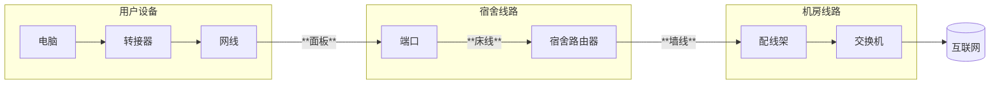
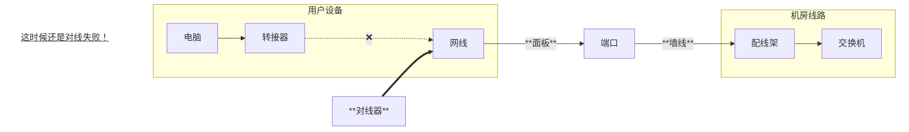
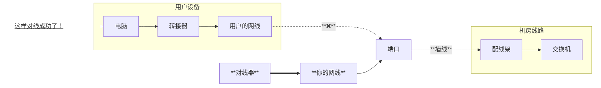

# 对线
宿舍以太网的连接由网线负责传输，如果网线，或者配线架，交换机这些物理设备本身的端口出现了问题，那么网络就当然无法连接🫠所谓对线，便是测试物理连接是否能工作的流程
## 操作流程
### 准备
打开寻线器，将寻线器的模式调到“对线”档位，将网线的一端插入到接口内，将另一端插入到要测试的端口
### 检查
如果寻线器上的1-8灯全部**按顺序**亮起的话，那么说明物理层连接没有问题，如果有哪个灯不亮，或是不按照顺序亮起的话，那么说明对应的电线不通;一般只要1,2,3,6灯亮起，那么网络就能保证最基本工作，但是网速会比较慢(大概100M)
## 排查
对线只能说明寻线器到信号发射设备（楼层交换机，宿舍路由器等）的整体线路有没有问题，如果有问题，对线操作本身无法测出是哪一个部分有问题，这个时候，就需要我们进行系统的方法测试排查

### 流程
下面是理想情况下校园网的结构，在实际工作中，每个片区我们只需要接触到其中的一部分：

对线结果显示有问题的话，我们可以更换已知的正常设备来排查错误的地方

假如你遇到了这样的情况：用户ip查不到，怀疑是物理连接错误，于是你将用户的网线从ta的电脑上拔下来，插在对线器上：

这个时候，对线还是失败的，于是你将用户的网线从端口上拔下来，拿出一根已知是工作正常的网线，插在对线器和端口上：

这下成功对线了，由此我们可以得出**是用户的网线有问题**

对于其它错误也是同样的道理，不断排除工作正常的环节，就可以确定工作不正常的环节，找到出现错误的地方之后，就可以按照情况进行修理了
