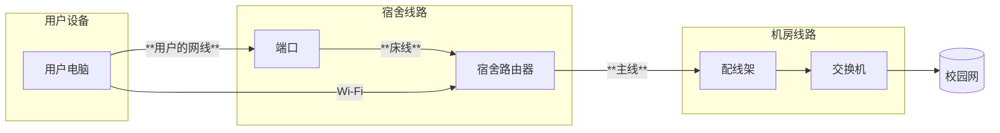

---

description: ...

---

# 东门片区信息

集合点：12栋楼下

范围：12-15 ， 20-22栋

工具包位置：12栋入口右手边桌子
## 网络结构
### 宿舍内部
用户端口连接到宿舍的路由器，路由器主线连接到楼层机房（机房好像进不去）

对于24新生的宿舍已采用了FTTR架构(10栋)

### 片区架构
12-15栋的有线网走的是9栋交换机，而AP直连学校核心交换机  
需要特别的注意

### 运营商
电信
### 其它
暂无
## 注意事项
部分房间可能会有AP,如果用户说网速很慢可以先看主线连接的是不是AP
