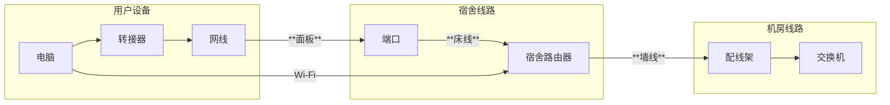

# 东门片区信息
范围：12-15 ， 20-22栋
## 集合点
**12栋楼下**
## 网络结构
### 线路
用户端口连接到宿舍的路由器，路由器主线连接到楼层机房（机房好像进不去）

对于24新生的宿舍已采用了FTTR架构(10栋)

```mermaid

graph LR
    subgraph 用户设备
    电脑-->转接器-->网线;
    end
    subgraph  宿舍线路 
    网线--**面板**--->端口--**床线**--->宿舍路由器;
    end
    subgraph 机房线路
    宿舍路由器--**墙线**--->配线架-->交换机;
    end
    电脑--Wi-Fi--->宿舍路由器
    
```
### 运营商
电信
### 其它
暂无
## 注意事项
部分房间可能会有AP,如果用户说网速很慢可以先看主线连接的是不是AP
