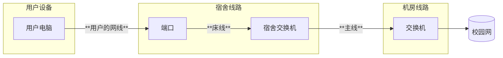

---

description: ...

---

# 凤翔片区信息

集合点： 值班室门口（超市和食堂旁边，在图书馆附近）

范围：1-6栋

工具包位置：2栋楼梯间的桌子下(梯子在楼梯间的隔间内)
## 网络结构
### 宿舍内部
用户的端口连接到楼层的交换机，位于天花板上，要爬梯子     \
电信在这中间还会有一个小交换机

### 片区线路
楼层的交换机设置在每栋的5楼和二楼，每栋的交换机之间级联备用。

核心交换机位于图书馆，所有交换机接入图书馆再接入学校核心交换机

### 运营商
电信，移动
### 其它
暂无
## 注意事项
- 进门可以看见一个梯子，
记得带梯子去值班，不管有没有单，每天下班时都要拍一张梯子的照片给值班组长
**记得拍梯子!!**

- 电信机房并不是每一层都有的.\
宿舍床位有两个端口，如果上面的标识难以辨别哪个是移动，哪个是电信的话，可以顺着电信小交换机的端口找到哪个是电信端口，剩下的就是移动端口了.

- 部分房间的墙线会有老化的情况，而导致速率很慢（甚至使用Wi-Fi都比用网线快），更严重的还有连接不稳定，甚至根本没法连接。除了让用户用Wi-Fi忍忍之外，也可以建议用户飞线，但是注意，网维不参与宿舍内飞线操作。

