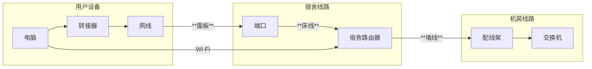

# 北门片区信息
:::warning 注意

🚧施工中🚧

这篇文章还没有写完呢！😛

:::
范围：7-11栋
## 集合点
**7栋门口**
## 网络结构

```mermaid

graph LR
    subgraph 用户设备
    电脑-->转接器-->网线;
    end
    subgraph  宿舍线路 
    网线--**面板**--->端口--**床线**--->宿舍路由器;
    end
    subgraph 机房线路
    宿舍路由器--**墙线**--->配线架-->交换机;
    end
    电脑--Wi-Fi--->宿舍路由器
    
```
### 线路
### 运营商
**电信**
### 其它
## 注意事项

机房没办法进去，运营商只有电信，光纤入户
