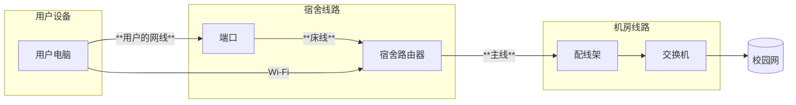

---

description: ...

---

# 北门片区信息

集合点：10栋楼下(从北门进学校一直走爬上楼梯)值班室旁边

范围：7-11栋

工具包位置：7栋的桌子里
## 网络结构
### 宿舍内部

### 片区架构

除了10栋A.B两栋之外，其余的楼栋接入位于9栋的核心交换机，北门核心交换机接入学校核心交换机

(实际上12-15栋部分网络也走这个核心交换机)

### 运营商
**电信**
### 其它
## 注意事项

- 机房没办法进去，运营商只有电信，光纤入户

- 部分房间的墙线会有老化的情况，而导致速率很慢（甚至使用Wi-Fi都比用网线快），更严重的还有连接不稳定，甚至根本没法连接。除了让用户用Wi-Fi忍忍之外，也可以建议用户飞线，但是注意，网维不参与宿舍内飞线操作。
