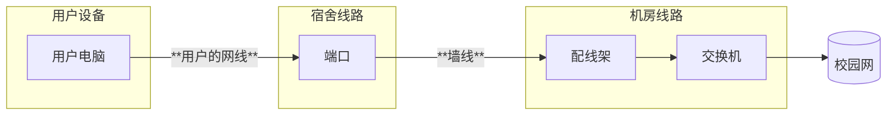

---

description: ...

---

# 朝晖片区信息

集合点：朝晖楼门口

范围：朝晖苑

工具包位置：门口右手边，值班室对面的房间的桌子里面，和售货机和打印机在同一个房间
## 网络结构
### 宿舍内部
用户端口直连配线架，配线架连接到交换机，没有床位表格，需要手动寻线

对于24新生的宿舍已采用了FTTR架构

### 片区架构

### 运营商
电信，移动
### 其它
暂无
## 注意事项
记得在宿管阿姨处借钥匙
