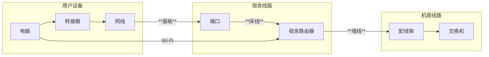

---

description: ...

---

# 歧头片区信息

:::warning 注意

🚧施工中🚧

这篇文章还没有写完呢！😛

:::
集合点： 19栋门口

范围：17-19栋

工具包位置：17栋入口处右手边桌子
## 网络结构
### 线路
用户端口连接到宿舍的路由器，路由器主线连接到楼层机房（机房好像进不去）

18-19栋好像也是和凤翔那样的楼层机箱，没有机房

电信：对于24新生的宿舍已采用了FTTR架构

移动：我暂时不清楚歧头移动的结构，等我调查之后再补充🤓
### 运营商
电信,移动
### 其它
暂无
## 注意事项
暂无
