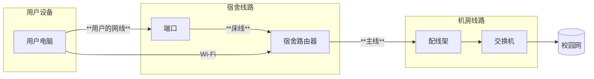

---

description: ...

---

# 歧头片区信息

集合点： 19栋门口

范围：17-19栋

工具包位置：17栋入口处右手边桌子
## 网络结构
### 宿舍内部
用户端口连接到宿舍的路由器，路由器主线连接到楼层机房

18-19栋好像也是和凤翔那样的楼层机箱，没有机房

电信：对于24新生的宿舍已采用了FTTR架构

移动：我暂时不清楚歧头移动的结构，等我调查之后再补充🤓

### 片区架构
> 16栋2楼 5楼有机房\
> 17栋2楼 5楼有机房\
> 18栋2楼 6楼有机房\
> 19栋只有1楼有机房\
> 一般来说，16-19栋第二个机房负责当层楼以及上方楼层

### 运营商
电信,移动
### 其它
暂无
## 注意事项
暂无
