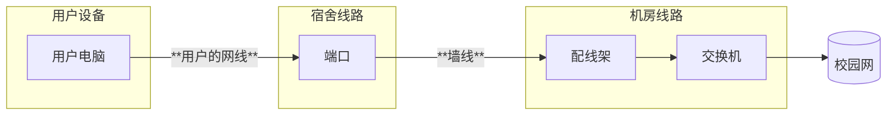

---

description: ...

---

# 香晖片区信息

:::tip 提示

由于香晖片区的范围比较大，所以分为AB和CD两个小组值班

:::
集合点：均在厚德楼A栋广场东侧的大树下

范围：香晖苑

工具包位置：AB在售货机旁边的桌子下;CD在正对大门的桌子下
## 网络结构
### 宿舍内部

电信：用户连接宿舍路由器（如果路由器LAN口不够会连接旁路交换机），路由器WAN连接机房交换机\
对于新生的宿舍已采用了FTTR架构

移动：用户的端口直接连接到弱电室的配线架，再经配线架连接到交换机，交换机处有床位对应表格，

### 片区架构

### 运营商
三大运营商都有服务，在维修时注意交换机不要接错

### 其它
移动更换了古董FTTB设备后没有进行调试，上电无法使用，且使用的设备缺少资料，可以略过这些大铁砖头，让用户去找移动客服
## 注意事项
- 记得在宿管阿姨处借钥匙
