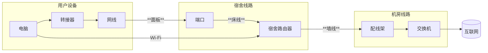
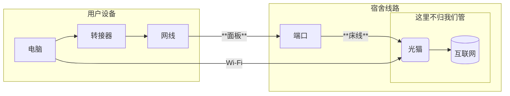
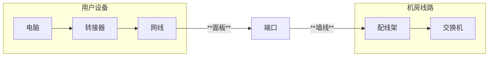

# 学校的网络结构
学校网络结构的整体介绍

:::warning 注意

🚧施工中🚧

这篇文章还没有写完呢！😛

:::

## 概况
电子科技大学中山学院校园网络分为教学网络和学生宿舍网络，教学网络主要用于学校各教学楼、实验楼、图书馆等供老师、教职工和学生上课上机使用，是属于教育科研网络。学生宿舍网络主要由中国电信、中国联通、中国移动直接提供服务，是属于运营商提供服务的网络。

无论是教学网络还是学生宿舍网络，都属于校园网，可访问学校图书馆、知网资源。但是，学生宿舍网络无法访问教学网络的部分资源（如实验楼FTP服务器、经管学院的实践教学中心模拟系统等），如有需要，可到图书馆访问。

**本维修手册，主要针对的是学生宿舍网络。**

目前（2025年5月），我校全部的学生宿舍，包括朝晖苑、香晖苑（ABCD栋）、凤翔宿舍区（1-6栋）、北门宿舍区（7-11栋）、东门宿舍区（12-15、20-22栋）、歧头山宿舍区（16-19栋）都可接入中国电信的上网服务。  

其中，歧头山宿舍区，朝晖苑、香晖苑（ABCD栋）和凤翔宿舍区（1-6栋）还可选择中国移动网络。  
只有香晖苑（ABCD栋）可选择中国联通的网络。

## 连接方式
**对于学生宿舍网络：**\
电信需要使用专门的客户端来连接，移动需要先在内网完成验证再连接，而联通是直接进行拨号连接\
**对于教学区公共Wi-Fi:**\
使用“掌上连峰”APP连接
## 架构

目前学生宿舍有线网有FTTB(光纤到每层楼)和FTTR(光纤入宿舍)两种方式，网维目前主要维护FTTB模式的有线网。

在FTTB模式下，每个用户的宿舍端口通过网线连接到设置在每个楼层的交换机(部分片区可能有AP中继)，每个楼层的交换机作为ONU使用光纤接入宿舍楼栋的交换机，然后接入学校的核心交换机。

各大运营商使用单独的交换机和AP，但是墙线是共享的，用户使用哪个运营商的服务，就由网维负责将用户的端口接入哪个运营商的设备。

每个有线网用户的端口都会被分配一个内网IP地址，172开头，号段由因运营商而异。

宿舍AP通常还提供Wi-Fi服务，Wi-Fi用户则通过每个宿舍的路由器AP连接网络，和有线网走同一个交换机（路由器AP通常是占用宿舍1号床的端口连接到交换机，这种情况下1号床的同学就需要把自己的网线插到路由器上，而不是插到已经占用的端口上）
### 电信
电信是学校的主要运营商，在各个宿舍片区都有提供服务，目前，电信主要是光纤接入楼层，然后通过ONU变成电信号转到各个宿舍的路由器（启用了Wi-Fi功能），然后再接入床位的端口（有的路由器可能路由器LAN不够，还会再接一个交换机）,如图：

电信有计划逐步升级到光纤入宿舍(FTTR)的模式，在这种模式下，将光路接到宿舍，接入一个集成有Wi-Fi路由功能的光猫，将双绞线接入各个端口，关于各大片区升级光纤网络的情况，请查看wiki的“片区信息”

电信的路由器带有Wi-Fi功能，提供无线接入的途径，产品名称叫做"F-Young",SSID以`FY`开头，一般是`FY-楼栋-宿舍号`

### 联通
联通目前只在香晖有提供服务，FTTB模式，没有宿舍AP

### 移动
FTTB模式下，移动的结构和联通差不多，也是宿舍直连交换机的结构  
移动还在部分的宿舍提供FTTR套餐，情况有待进一步研究
