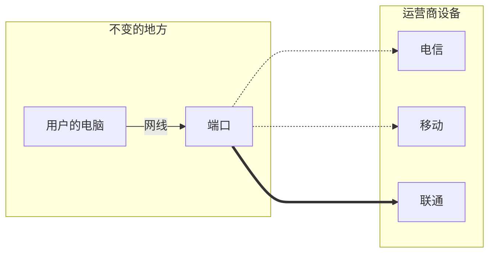
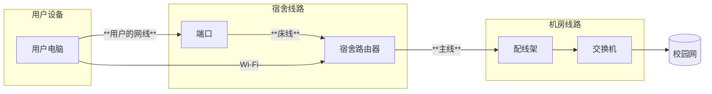
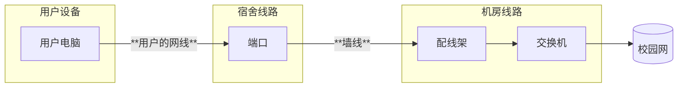
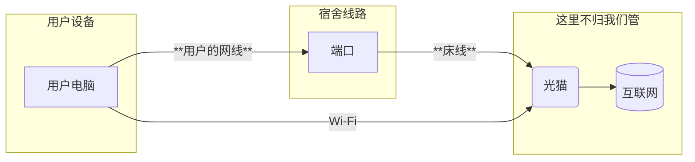

# 学校的网络结构
学校网络结构的整体介绍

:::warning 注意

🚧施工中🚧

这篇文章还没有写完呢！😛

:::

## 概况
电子科技大学中山学院校园网络分为教学网络和学生宿舍网络，教学网络主要用于学校各教学楼、实验楼、图书馆等供老师、教职工和学生上课上机使用，是属于教育科研网络。学生宿舍网络主要由中国电信、中国联通、中国移动直接提供服务，是属于运营商提供服务的网络。

无论是教学网络还是学生宿舍网络，都属于校园网，可访问学校图书馆、知网资源。但是，学生宿舍网络无法访问教学网络的部分资源（如实验楼FTP服务器、经管学院的实践教学中心模拟系统等），如有需要，可到图书馆访问。

**本wiki，主要针对的是学生宿舍网络。**

目前（2025年5月），我校全部的学生宿舍，包括朝晖苑、香晖苑（ABCD栋）、凤翔宿舍区（1-6栋）、北门宿舍区（7-11栋）、东门宿舍区（12-15、20-22栋）、歧头山宿舍区（16-19栋）都可接入中国电信的上网服务。  

其中，歧头山宿舍区，朝晖苑、香晖苑（ABCD栋）和凤翔宿舍区（1-6栋）还可选择中国移动网络。  
只有香晖苑（ABCD栋）可选择中国联通的网络。

校园网络核心交换机位于实验楼，校园网的两个部分（办公网和学生网）在这里分别接入电信局的认证服务器，连接中山市的国际互联网出口。

## 连接方式
**对于学生宿舍网络：**\
三大运营商都有有线连接方式，电信和移动的部分宿舍有Wi-Fi连接方式\
**对于教学区公共Wi-Fi:**\
使用“掌上连峰”APP连接
## 宿舍内部架构
我们首先介绍一个宿舍中的结构：

目前学生宿舍有线网有FTTB(光纤到每层楼)和FTTR(光纤入宿舍)两种方式，网维目前主要维护FTTB模式的有线网。

在FTTB模式下，每个用户的端口通过**网线**连接到设置在每个楼层的交换机，每个楼层的交换机作为ONU使用**光纤或网线**接入学校更大的网络

各大运营商都有自己的楼层交换机和宿舍路由器(如果有)，但是从用户到交换机的墙线是共享的，用户使用哪个运营商的服务，就由网维负责将用户的端口接入哪个运营商的设备。

*用户用什么运营商，网维就负责把端口接到哪里去～比如用户接的是联通，那么线路就是电脑-->端口-->联通的交换机*  
(另外，每个有线网用户的端口都会被分配一个内网IP地址，172开头，号段由因所接的运营商而异。详见下一篇文章)

### 宿舍路由器

**在男生片区和部分女生片区，会有宿舍路由器/宿舍交换机中继**

宿舍路由器通常还提供Wi-Fi服务，路由器有的是占用宿舍1号床的端口连接到交换机，这种情况下1号床的同学就需要把自己的网线插到路由器上，而不是插到已经占用的端口上：

*一共有两种情况，也就是路由器是不是占用某个同学的端口连接到楼层交换机的*

总结一下：

或是没有路由器的情况：

### FTTR架构
在FTTR下，把路由器换成光猫，光猫暂时不归网维管，所以结构是这样的：

## 校园网架构
:::tip 提示

下面所说均为电信网络架构，内容比较老且可能不符合实际情况，仅供参考。

:::

如图所示，学校的核心交换机(华为S9306)设置在实验楼(具体地点未知)，连接如下汇聚交换机：

|名称|型号|位置|下联|备注|
|-|-|-|-|-|
|**图书馆主交换机**|华为S9303|图书馆内|凤翔所有楼层交换机|凤翔除5栋在3楼、5楼外，其余楼栋电信交换机设置在2楼、5楼；交换机之间有级联|
|**新区主机房核心交换机**|华为S9303|9栋|7,8,9,11，12-15栋的有线网络|12-15栋AP独立连接至学校核心交换机，不走这个|
|**21栋4层S3352-1**|华为S3352|21栋4层机房，第一个|20,21栋，22栋A座1楼|暂无|
|**香晖核心交换机**|华为S9306|未知|香晖ABCD栋|有可能位于AB栋的某一处|
|**朝晖主交换机**|华为S5320|朝晖2楼，第一个 |朝晖苑|网络结构可能是：其余楼层汇聚至2层的交换机，2层交换机连接至学校核心交换机|
|**16-17栋核心交换机**|华为S8505|未知|16-17栋|楼层交换机位于2楼和5楼|
|**18-19栋核心交换机**|华为S8505|未知|18-19栋|18栋交换机在2楼、6楼，19栋只有1楼有机房；|
<!--
- 图书馆交换机S9303:汇聚凤翔所有楼层交换机，位于图书馆内
- 北门主交换机S9303:汇聚7,8,9,11，12-15栋的有线网络(12-15栋AP独立连接至核心交换机)，位于9栋
- 21栋S3352,汇聚20,21栋，位于21栋4层，编号S3352-1
- 香晖主交换机S9306:汇聚香晖ABCD栋，地点未知
- 朝晖交换机S5320，汇聚朝晖苑，位于朝晖2楼，编号S5320-1
- 16-17栋交换机S8505,汇聚16-17栋，地点未知
- 18-19栋交换机S8505,汇聚18-19栋，地点未知-->

*学校的总体网络结构，图片有点老，有的地方可能不准确*

对于每个片区的详细结构线路，请自行查看每个片区的信息。

## 参考

[1]https://baike.baidu.com/item/%E7%94%B5%E5%AD%90%E7%A7%91%E6%8A%80%E5%A4%A7%E5%AD%A6%E4%B8%AD%E5%B1%B1%E5%AD%A6%E9%99%A2%E4%BF%A1%E6%81%AF%E4%B8%AD%E5%BF%83/1180595

[2]https://baike.baidu.com/item/%E7%94%B5%E5%AD%90%E7%A7%91%E6%8A%80%E5%A4%A7%E5%AD%A6%E4%B8%AD%E5%B1%B1%E5%AD%A6%E9%99%A2%E7%BD%91%E7%BB%9C%E7%BB%B4%E6%8A%A4%E7%A7%91

