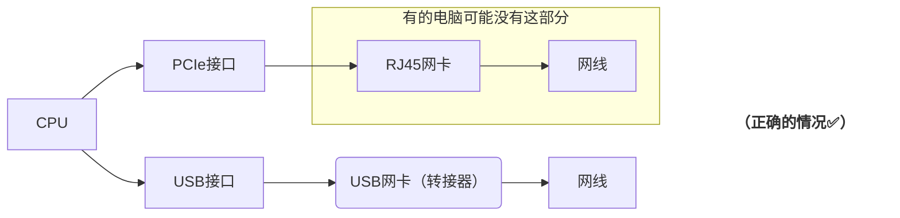

# 转接器
关于转接器，你必须知道的事情！
## 介绍

现今的许多笔记本电脑为了做到机身更轻薄，和出于用户需求量的考虑，都不内置RJ45接口了。那我们要在这种笔记本上使用有线网，就得在电脑的USB口上插一个转接器。

可是，你真的了解这个其貌不扬的小玩意吗？你知道为什么更换转接器会导致拨号691错误吗？你知道转接器的网速可能比原生网口的网速还要快得多吗？

## 本质

“转接器”这个名字本身就非常具有欺骗性：你可能以为，转接器负责把网线数据转换成USB数据交给电脑的网卡处理；然而事情并不是这样：**转接器本身就是一张独立，完整的网卡**；转接器和电脑有线网卡的唯一区别就是：转接器网卡通过USB总线连接至CPU,而电脑内置网卡通过PCIe总线连接至CPU。除此之外，它们的功能，地位都完全相等。

---

---

---

*（严谨地说，有的计算机系统的内置网卡也是走USB总线的(树莓派等)，有的虽然物理上是PCIe接口，但是用的是USB协议通信。不过科普文章嘛，就不讲那么多了。反正转接器的接口和协议都是USB就对了）*

### MAC地址
既然转接器的本质是网卡，那么当用户更换转接器时，拨号出现691错误也就不奇怪了：运营商为了确保一个账户只供一个人使用，会记下第一个连接某个交换机端口的设备的MAC地址；如果用户使用了不同的MAC地址连接端口拨号的话，运营商就会直接拒绝登录；

而每个网卡都有一个独特的MAC地址，当用户更换转接器时，发送给端口的MAC地址相应地也变化了，运营商就会拒绝登录；我们打客服电话或者联系组长解绑刷新就好；
## 芯片
市面上的转接器那么多，其实它们基本上就是少数几个USB网卡芯片的各种套壳罢了；这和PC行业是差不多的：CPU,显卡等部件是绝对的核心，不同电脑的品牌，只是这些核心的不同组装厂；市面上电脑那么多，但是CPU，显卡品牌和型号就那么几个。

而市面上常见的转接器，它们所使用的核心芯片比CPU的型号要少多了；基本上，你在市场上可以看到的几乎所有千兆转接器，**无非是下面这两种型号芯片的套壳：**

- Realtek(瑞昱) RTL8153/8153b
- ASIX(亚信) AX88179/88179A

如果你想买到便宜又好用的转接器，你可以直接在淘宝上搜`RTL8153b`或者`AX88179A`，没必要迷信什么大牌；大牌通常60～70块一个的转接器，通常35块左右就可以买到同样性能的。当然，就算是同样的芯片，各家的外围电路做工用料，散热的设计等也不一样，所以也不能一昧挑便宜的买。

## 芯片速率
上面介绍的这两款芯片，基本上都是向下兼容的千兆芯片，它们用的都是USB3.0，因为USB2.0理论带宽480Mbps，实际有效速率约320-400Mbps，根本没法满足千兆网的需求；而USB3.0最高能支持到五千兆的速率，USB3.1则是万兆；

瑞昱也有做2.5GBE和5GBE的芯片，型号分别是`RTL8156b` 和 `RTL8157`，同样，直接在淘宝上搜关键词也可以买到便宜的高端转接器，而不用加价买大厂的高端溢价型号。

那么问题来了，许多轻薄本虽然有内置的RJ45网卡，但是因为各种原因规格只有千兆；而这些电脑通常都有USB3.0接口；我们就得到了一个反直觉的问题：这种情况下使用转接器的速度是不是要比用原生网口的速度还快？

是的，不过我们学校的网络套餐最高只有千兆，所以这个问题在我们学校没有太大意义；不过下次如果你在用千兆网卡的轻薄本访问NAS或者用超千兆宽带的时候，不妨尝试一下用转接器！

## 手机
基本上你的安卓手机只要不是太老和太丐版，都支持使用转接器连接以太网，在手机设置里搜索一下“以太网”，看看有没有对应选项。如果支持以太网的话，可以在值班的时候带上一个转接器，用你的手机来调试端口。就不用把用户的电脑带过去机房了，转接器推荐买上面说的那两个千兆型号，因为这是市面上使用最广泛的两个型号，兼容性是最好的。

关于苹果手机，苹果对于以太网的支持比较慢，根据网上的资料，`AX88179A`的兼容性可能比`RTL8153b`要好一些，官网上卖的或者Belkin这类品牌通过MFi认证的，用的都是AX88179。

## 其它
### 用户转接器
如果用户说网络不稳定或者网速慢的话，可以看看是不是转接器的问题：正如我们上面所说，市面上好的转接器无外乎于那两种芯片，在`设备管理器`-->`网络适配器`这里可以看到用户芯片的型号，如果不显示型号，或者型号不是上面那两种芯片的话，那么转接器大概率就有问题，通常是杂牌无良商家用了某些杂牌芯片。建议用户买大牌转接器或者那两种型号芯片的转接器。这两种芯片正常情况下免驱，如果用户的系统有点老(比如Windows7)，没法识别的话可以在官网手动下驱动安装。

如果用户说网速慢的话，可以看一下用户是不是在用USB2.0的百兆转接器，这种转接器速率上限就只有百兆，相当于网线8芯都不全通。建议用户换成质量好一点的USB3.0的转接器。

### RD9700

前辈写的网络维修手册里点名批评了一个型号为`RD9700`的芯片，这款芯片问题比较多，不是太稳定；如果遇到用户的网络出现问题的话，可以先看看ta的转接器型号，在`设备管理器`-->`网络适配器`这里可以看到；如果看不到的话，可以尝试打一下驱动，在下载中心有。

根据[网上的说法](https://www.youtube.com/watch?v=PUJ8nCmfaS0)，这款芯片连USB2.0都不是，而是USB1.1。怎么说呢...不要为了贪便宜买这种转接器，也劝用户别用。

### 协商

千兆或以上的转接器通常都有“协商”的机制，就是检查网络链路中速度最低的那个环节和所有设备的双工性，然后向下兼容到那个设备的速度和双工性；

比如你的转接器是千兆的，套餐是千兆的，到交换机的墙线质量也足够支持千兆，但是你用了运营商送的那种劣质网线，网线最高支持100M,那么转接器就会在100M的速度下工作；这就像转接器和其它设备一起合作，协商出一个大家都可以支持的速度。

我们推荐的两款转接器都是有10M/100M/1000M三种模式的速度，自动协商合适的速度的。在极少数情况下，协商机制可能会导致联网失败，这个时候就需要手动禁用协商：

在Windows的设备管理器中，可以右键点击`网络适配器 `-> `属性` -> `高级` 选项卡，有时这里会出现如“速度和双工模式”（Speed & Duplex）等参数，可以手动调整速度和双工性，比如设置到“1.0Gbps全双工”，在遇到网络疑难杂症时可以尝试这个办法。
