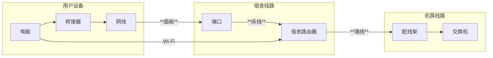
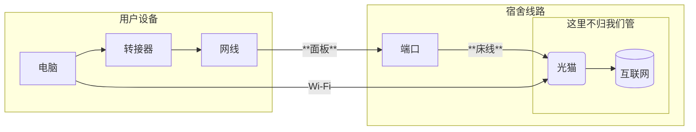
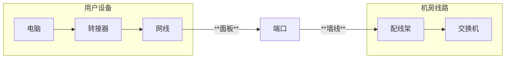

# plots
## 单用户的网络拓扑图

```mermaid

graph LR
    subgraph 用户设备
    电脑-->转接器-->网线;
    end
    subgraph  宿舍线路 
    网线--**面板**--->端口--**床线**--->宿舍路由器;
    end
    subgraph 机房线路
    宿舍路由器--**墙线**--->配线架-->交换机;
    end
    电脑--Wi-Fi--->宿舍路由器
    
```
## 光猫网络结构图

```mermaid

graph LR
    subgraph 用户设备
    电脑-->转接器-->网线
    end
    subgraph  宿舍线路 
    网线--**面板**--->端口
    端口--**床线**--->gm(光猫)
    subgraph 这里不归我们管
    gm-->hlw[(互联网)]
    end
    end 
    电脑--Wi-Fi-->gm

```
## 联通和移动的网络结构图

``` mermaid


graph LR
    subgraph 用户设备
    电脑-->转接器-->网线;
    end 
    网线--**面板**--->端口--**墙线**--->配线架
    subgraph 机房线路
    配线架-->交换机;
    end

```
